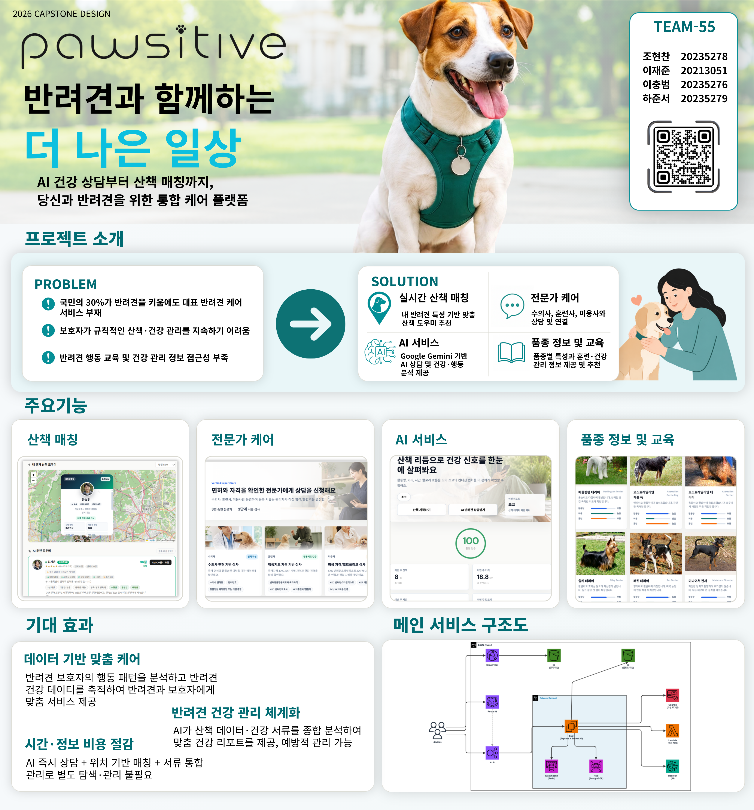
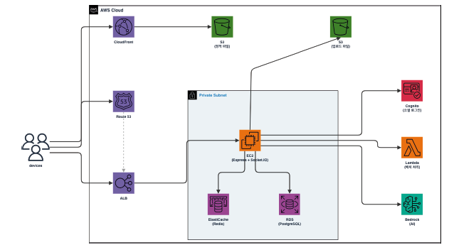

[](https://classroom.github.com/a/Lvs6kcL8)

<div align="center">
  
  <h1>Pawsitive (포지티브)</h1>
  <p><strong>Be Pawsitive! 반려견과 함께하는 더 나은 일상</strong></p>
  <p>AI 건강 상담부터 산책 매칭까지, 당신과 반려견을 위한 통합 케어 플랫폼.</p>

  <a href="https://competent-famished-leatrice.ngrok-free.dev">
    
  </a>
  <a href="https://kookmin-sw.github.io/2026-capstone-55/">
    
  </a>

  <br/><br/>

  
</div>


---

## 목차

- [1. 프로젝트 소개](#1-프로젝트-소개)
- [2. 주요 기능 소개](#2-주요-기능-소개)
- [3. 주요 화면](#3-주요-화면)
- [4. 시스템 아키텍처](#4-시스템-아키텍처)
- [5. 기술 스택](#5-기술-스택)
- [6. 팀원 소개](#6-팀원-소개)
- [7. 설치 및 실행](#7-설치-및-실행)


---

## 1. 프로젝트 소개

 ### **| "Pawsitive : AI 기반 반려견 통합 케어 플랫폼"**

현대 사회에서 반려견 양육 가구는 **꾸준히 증가**하고 있지만, 보호자들은 바쁜 일상 속에서 산책, 건강 관리, 행동 상담 등을 **체계적으로 관리하는 데 어려움**을 겪고 있습니다. 또한 **자신의 반려견에 대한 정보와 지식 부족**으로 적절한 대응이 어려운 경우도 많습니다.

그러나 현재 반려견 관련 서비스들은 산책, 건강 관리, 상담 등의 기능이 각각 분리된 앱과 사이트로 운영되어 여러 서비스를 따로 이용해야 하는 불편함이 존재합니다. 이로 인해 **건강 기록과 관리 정보가 분산되어 지속적이고 체계적인 관리가 어려운 문제가 발생**하고 있습니다.

저희는 이러한 문제를 해결하기 위해 AI 기반 반려견 통합 케어 플랫폼 **Pawsitive(포지티브)**를 개발하였습니다. Pawsitive는 **실시간 산책 매칭, AI 건강 분석, 전문가 및 도우미 매칭, AI 상담, 건강 서류 통합 관리 기능을 하나의 서비스로 제공**하여 보호자와 반려견 모두의 더 나은 일상을 지원합니다. 또한 AI 기술을 활용해 반려견의 활동 데이터와 건강 정보를 분석하고 맞춤형 서비스를 제공함으로써 보다 **편리하고 체계적인 반려 생활 환경을 제공**합니다.


### **Pawsitive만의 강점**

✅ **Pawsitive**는 실시간 산책 매칭 기능을 통해 주변 보호자 및 산책 도우미와 연결하여 안전하고 효율적인 산책 환경을 제공합니다.

✅ **Pawsitive**는 훈련사·전문가 매칭 기능을 통해 행동 교정, 건강 관리 등 반려견 상황에 맞는 전문 상담과 도움을 빠르게 받을 수 있습니다.

✅ **Pawsitive**는 Gemini 기반 AI 상담 시스템과 AI 건강 분석 기능을 활용하여 반려견의 활동 데이터와 건강 정보를 기반으로 맞춤형 건강 리포트 및 상담 서비스를 제공합니다.


---

## 2. 주요 기능 소개

| 기능 | 설명 |
|------|------|
| **산책 매칭** | 지도 기반 주변 산책 도우미 탐색, 브로드캐스트 매칭, 실시간 위치 추적, GPS 경로 기록, 리뷰·별점 |
| **전문가 케어** | 수의사·훈련사·미용사 목록 탐색, 토스페이먼츠 결제 후 1:1 채팅 상담방 개설 |
| **AI 서비스** | Gemini AI 증상 분석·대처법 제시, 라이프스타일 기반 품종 추천, Claude AI 심층 건강·행동 상담 |
| **품종 정보 및 교육** | 380여 종 품종 도감 검색, 반려견 교육 콘텐츠 제공 |
| **커뮤니티** | 게시물 작성(사진·동영상 첨부), 좋아요·댓글, 스토리, 팔로우, DM, AI 맞춤 게시물 추천 |


---

## 3. 주요 화면


---

## 4. 시스템 아키텍처

<div align="center">
  
</div>

### 목표 아키텍처

상용화 및 대규모 트래픽 처리를 대비하여 AWS 기반 고가용성 아키텍처를 설계하였습니다.

- **네트워크** — Route 53 → ALB로 트래픽 분산, 정적 자원은 S3 + CloudFront CDN으로 글로벌 캐싱
- **컴퓨팅/데이터** — Private Subnet 내 EC2에서 Express + Socket.IO 구동, ElastiCache(Redis)로 실시간 세션 캐싱, RDS(PostgreSQL)로 영구 데이터 저장
- **고도화 기능** — Cognito(소셜 로그인), Lambda(백그라운드 연산), Bedrock(AI 상담 분석) 연동

### 현재 MVP 구현

캡스톤 프로젝트의 한정된 시간과 인프라 비용을 고려하여, 핵심 비즈니스 로직(실시간 산책 매칭, Gemini AI 상담 분석)의 완성도에 집중하는 전략을 선택하였습니다. 현재는 단일 Node.js(Express) 서버 + JSON 파일 기반 데이터 저장 + 브라우저 웹 스토리지를 활용한 하이브리드 구조로 구현되어 있으며, 향후 상용화 시 위 AWS 아키텍처로 전환할 수 있도록 설계되었습니다.


---

## 5. 기술 스택

| 구분 | 기술 |
|------|------|
| Frontend |    |
| Backend |   |
| AI |   |
| 지도 |  |
| 실시간 통신 |  |
| 인증 |     |
| 결제 |  |


---

## 6. 팀원 소개

| 이름 | 역할 | 기여 내용 |
|------|------|-----------|
| **조현찬** | 팀장, 풀스택 개발 | 프로젝트 총괄, 교육 컨텐츠, 품종 정보, AI 상담 기능 구현 |
| **이재준** | 풀스택 개발 | 서버 아키텍처 설계, 전문가 매칭, 커뮤니티 기능 구현 |
| **이충범** | 풀스택 개발 | 산책 매칭·GPS 추적, 워커 대시보드, UI 설계, 리뷰·평점 시스템 구현 |
| **하준서** | 풀스택 개발 | AI 건강 분석, 프로필·반려견 건강서류 관리, 알림 시스템 구현 |


---

## 7. 설치 및 실행

```bash
git clone https://github.com/kookmin-sw/2026-capstone-55.git
cd 2026-capstone-55
npm install
npm start
# http://localhost:3000
```

팀페이지: [https://kookmin-sw.github.io/2026-capstone-55/](https://kookmin-sw.github.io/2026-capstone-55/)
